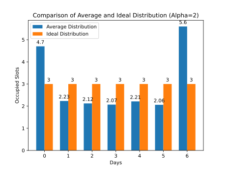
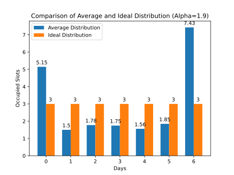
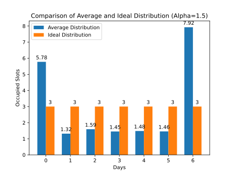
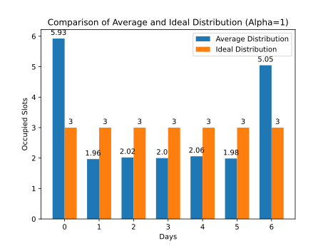

# RL Task Scheduler

This project implements a multi-agent reinforcement learning system for optimizing surgery scheduling in a hospital environment. It uses the Multi-Agent Deep Deterministic Policy Gradient (MADDPG) algorithm to train agents to make efficient scheduling decisions.

## Installation and run
There is a fast way to install all dependencies and run the experiment using bash script `run.sh`. First you need to open a project folder in the Visual Studio Code and call the terminal. Write this line in a bash console:

```
./run.sh
```
This will start the next pipeline: learning process, evaluation and visualization. It's recommended to set up smoothing to 0.85 for plots are highly oscillating.

Note, in some cases you need to give your system a permission to run this script:
```
chmod + run.sh
```

If you wish to install and launch all by yourself, there is a `requirements.txt` file. In this case open a terminal window and write next to create a separated copy of a virtual environment:

```
python3 -m venv env
```
Than you need to get to a `env/bin` or `env/Scripts` directory which depences on your system and activate the virtual environment with next command:

```
source activate
```

Probably now you will see a `(env)` apostroph in you terminal. When ready write next to install all the necessary requirements:

```
python3 -m pip install -r requirements.txt
```
None, in some cases you need to change `python3` to `python` or whatever alias is already set in your system.

Now you will be able to separatly launch `train.py` and `evaluate.py` python scripts like this:

```
python3 train.py
```

## Results and visualization

Here are the tensorboard log charts of MADDPG training process (scaled for Alpha=2, 1.9 and 1.5):

<p align="center">
  
  
  
  
</p>

Here are the tensorboard log charts of MADDPG training process (scaled for Alpha=2, 1.9, 1.5 and 1):

<p align="center">
  
  
  
  
</p>

Histograms of average distribution from ideal distribution are presented below:

<p align="center">
  
  
  
  
</p>

## Additional settings and considerations

In the bash script you will find some default game environment setting to run the experints:
- `MAX_CAPACITY` - the maximum throughput capacity of a day in the planning horizon;
- `MAX_AGENTS` - the maximun number of unique agents, that are currently operating in environment;
- `MAX_DAYS` - the maximum length of a moving window of a planning horizon;
- `MAX_EPISODE_LENGTH` - the maximum duration of a unit game episode.

You may change these numbers, especially the maximum throughput capacity. By default it's uniform across the planning horizon, but if you would like to you do may set a custom distribution using `ideal_state` variable inside `sheduler.py` script.

In case you need to run the trained algorithm on a bigger set of agents you could train twelve unique agents related to a twelve unique combinations of their internal state variables. Than assign every new agent policy equal to the one of these twelve trained polices and that would be enough to somewhat generalize algorithm to operate on an arbitrary set of agents. Note, it's hard to tell if this good enough for your case or not.

In case you need to apapt your agents to operate with a moving planning horizon you probably would like to set a bigger value `num_envs` in a `train.py` script and initialize each game environment with a different `ideal_state` parameter in `sheduler.py` script. This will help agent to generalize their behavior to a different circumstances and mitigate overfitting to a fixed environment. Note, that this will probably cost you a lot of time as the training process will go slowly.

You may find documentation [here](https://github.com/artemisak/rl-task-scheduler/blob/main/DOCUMENTATION.md).
